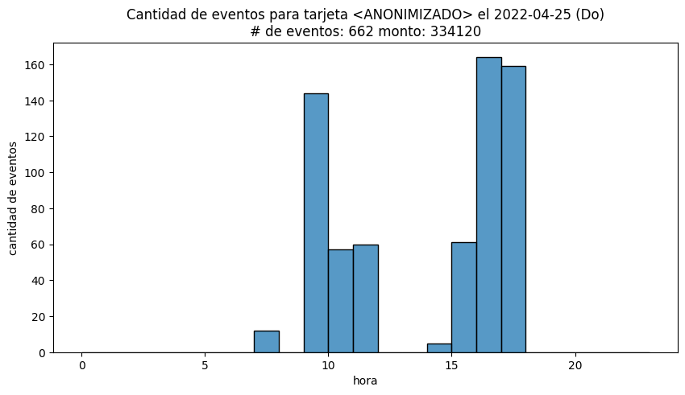
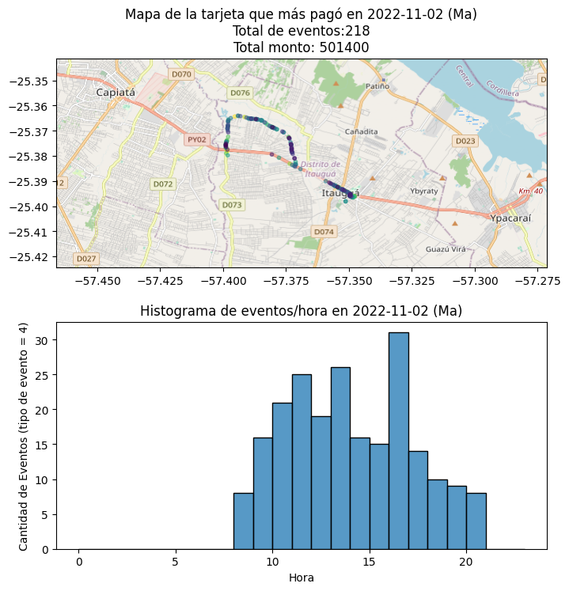
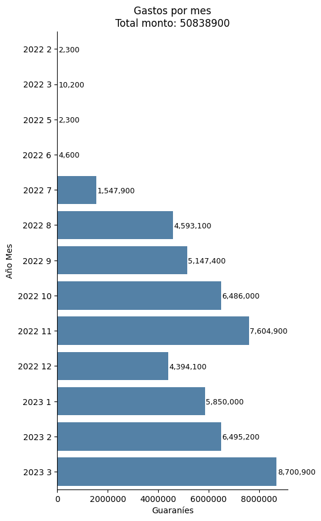

# opama
Análisis de datos de transporte del área metropolitana de Asunción

# Resultados preliminares

Con estadísticas simples se ven algunos casos que resultan poco razonables si uno piensa en un pasajero convencional. Por ejemplo, usar un servicio de bus 662 veces en el mismo día (particularmente un Domingo).

Otro ejemplo es el de una tarjeta que gastó más de Gs 50.000.000 entre Julio 2022 y Marzo 2023. Podemos ver el día con más eventos de esta tarjeta, donde usó un mismo bus 218 veces. La única explicación razonable es que esta tarjeta fuese validada por el chofer de forma constante.

Esta misma tarjeta, consistentemente gasta múltiples veces el valor del salario mínimo en pasajes.

